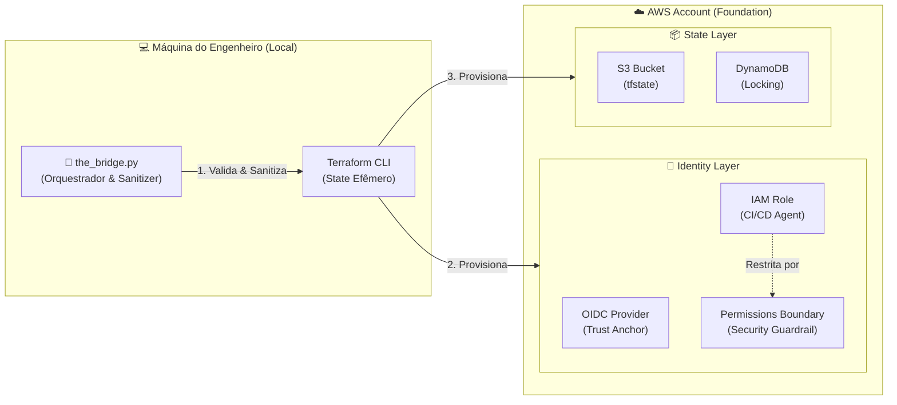

# 🌉 A PONTE (The Bridge) - Foundation & Identity Engine

> **Pilar:** Segurança & Governança (Identity Layer).
> **Missão:** Resolver o paradoxo do "Ovo e a Galinha" na AWS com segurança Zero Trust.

**A PONTE** é o motor de engenharia que provisiona a fundação de segurança necessária para operar na nuvem moderna. Ela elimina a necessidade de chaves de acesso de longa duração (`AWS_ACCESS_KEY_ID`) criando uma federação direta entre o GitHub e a AWS.

---

## 🎥 Demo
https://github.com/user-attachments/assets/feda1c96-3d0d-4976-ab6c-d2d17cb425c0

## 🏗️ Arquitetura de Bootstrap (Como Funciona)



A segurança desta ferramenta baseia-se no padrão **OpenID Connect (OIDC)** e em **Permissions Boundaries**, eliminando a necessidade de usuários IAM e mitigando riscos de escalação de privilégios.

### 1. Federação de Identidade (Web Identity Federation)
Em vez de credenciais, estabelecemos uma relação de confiança entre o Provedor de Identidade do GitHub (`token.actions.githubusercontent.com`) e o AWS STS.

*   **Fluxo de Autenticação:**
    1.  O GitHub Actions solicita um JWT assinado pelo GitHub.
    2.  Envia o token para a AWS (`sts:AssumeRoleWithWebIdentity`).
    3.  A AWS valida a assinatura e a **Condition Key** `sub` (Subject).
    4.  Retorna credenciais temporárias para a Role.

### 2. IAM Role & Trust Policy (A "Fechadura")
A Role criada (`*-github-actions-role`) possui uma **Trust Policy** rigorosa:

```json
{
  "Effect": "Allow",
  "Principal": { "Federated": "arn:aws:iam::ACCOUNT_ID:oidc-provider/..." },
  "Action": "sts:AssumeRoleWithWebIdentity",
  "Condition": {
    "StringLike": {
      "token.actions.githubusercontent.com:sub": "repo:SEU_USUARIO/SEU_REPO:*"
    }
  }
}
```
*   **Segurança:** A condição `StringLike` garante que **apenas** workflows do repositório especificado podem assumir esta role.

### 3. Permissions Boundary (O "Teto de Vidro") 
Para mitigar o risco de **Privilege Escalation**, todas as Roles criadas por esta ferramenta (e pelo Terraform subsequente) são restritas por uma **Permissions Boundary** (`*-infra-boundary`).

*   **Bloqueio de IAM:** Impede a criação de usuários IAM, Login Profiles ou Access Keys (evita Backdoors).
*   **Self-Protection:** Impede que a Role delete ou modifique a própria Boundary ou as Policies de segurança do Bootstrap.
*   **Compliance Forçado:** O Terraform só consegue criar novas Roles (ex: para EC2) se anexar esta Boundary a elas. Caso contrário, a AWS nega a criação (`AccessDenied`).
*   **Anti-Boundary Escape:** Nega explicitamente `iam:DeleteRolePermissionsBoundary`. Mesmo que uma role tenha permissões administrativas dentro do escopo, ela é tecnicamente incapaz de remover sua própria restrição ("Teto de Vidro").

### 4. IAM Policy (O "Escopo de Acesso")
A política operacional (`*-devops-policy`) segue o princípio de **Privilégio Mínimo Viável para IaC**.

| Categoria | Permissões | Justificativa Técnica |
| :--- | :--- | :--- |
| **Terraform Backend** | `s3`, `dynamodb` | Restrito aos recursos de estado (`*-tfstate-bucket`, `*-tf-lock-table`). |
| **Compute & Network** | `ec2:*`, `ecr:*` | Provisionamento de infraestrutura. |
| **IAM Management** | `iam:CreateRole`, etc. | Permitido apenas se a **Permissions Boundary** for anexada. |
| **Identity Sandbox** | `iam:PassRole` | **Anti-Lateral Movement:** Utiliza lógica de `NotResource` para bloquear `PassRole` em qualquer role que não inicie com o nome do projeto. Impede o sequestro de roles administrativas da conta. |

---

## 🛠️ Engenharia do Script (`the_bridge.py`)

O orquestrador Python implementa lógicas avançadas de segurança e resiliência.

### Funcionalidades Avançadas:
1.  **Input Sanitization (Anti-Injection):**
    *   Todos os inputs (Projeto, Região, Repo) passam por validação rigorosa de Regex (`^[a-zA-Z0-9-]+$`) antes de serem usados em comandos de shell, prevenindo **Command Injection**.

2.  **Bypass de Variáveis de Ambiente (Windows Safe):**
    *   Gera dinamicamente um arquivo `terraform.tfvars.json` efêmero para garantir a injeção correta de variáveis complexas em ambientes Windows.

3.  **Self-Healing (Auto-Cura):**
    *   Verifica a existência de recursos via Boto3/CLI e executa `terraform import` automaticamente se necessário, garantindo idempotência.

---

## 🚀 Guia de Uso (Operacional)

### Pré-requisitos
*   Python 3.x
*   Terraform >= 1.0
*   AWS CLI (configurado com `AdministratorAccess` apenas para o bootstrap).

### Execução
**Modo Interativo:**
```bash
python the_bridge.py
```

**Modo Batch (Automação):**
```bash
python the_bridge.py --batch --project-name "Prod" --aws-region "us-east-1" --github-repo "org/infra-core"
```

### Pós-Execução (Integração CI/CD)
Ao final da execução, o script exibirá um **Guia de Integração**. Você deve configurar dois valores no seu repositório GitHub para permitir que o pipeline funcione.

Acesse: **Settings > Secrets and variables > Actions**

#### 1. Aba "Secrets" (Segredos)
Crie um **New repository secret**:
*   **Nome:** `AWS_ROLE_TO_ASSUME`
*   **Valor:** O ARN da Role exibido pelo script (ex: `arn:aws:iam::123456789012:role/prod-github-actions-role`).

#### 2. Aba "Variables" (Variáveis)
Crie uma **New repository variable**:
*   **Nome:** `PERMISSIONS_BOUNDARY_ARN`
*   **Valor:** O ARN da Boundary exibido pelo script (ex: `arn:aws:iam::123456789012:policy/prod-infra-boundary`).
    *   *Nota: Isso é obrigatório para que o Terraform possa criar novas Roles (ex: EC2) em conformidade com as regras de segurança.*

---

## 🧹 Disaster Recovery & Cleanup (AWS Nuke)

Este projeto inclui um módulo de **Limpeza Automatizada** (`nuke-aws/`) para ambientes de desenvolvimento. Ele permite resetar a conta AWS para um estado limpo, removendo recursos criados por testes (EC2, VPC, ECR) mas **preservando a fundação crítica**.

### O que é protegido (Safe Guard):
*   ✅ OIDC Provider & IAM Roles do GitHub.
*   ✅ Bucket S3 do Terraform State.
*   ✅ Tabela DynamoDB de Lock.
*   ✅ O próprio usuário Admin que executa a limpeza.

### Como executar a limpeza:
```powershell
cd nuke-aws
.\nuke-cleanup.ps1
```

---

## ⚠️ Matriz de Riscos & Mitigações

| Risco | Severidade | Mitigação Implementada |
| :--- | :--- | :--- |
| **Privilege Escalation** | Crítica | **Permissions Boundary:** Bloqueia criação de Users e edição de Policies críticas. |
| **Command Injection** | Alta | **Input Sanitization:** Regex estrito no script Python. |
| **Lockout (Delete Acidental)** | Alta | **Lifecycle Prevent Destroy:** Terraform impede destruição de recursos de identidade. |
| **Confused Deputy** | Média | **Trust Policy Condition:** Validação estrita do `sub` (Repo) do GitHub. |
| **Lateral Movement** | Crítica | **Resource Sandbox:** Bloqueio de `PassRole` para roles externas ao projeto via `NotResource`. |

---
*Developed for High-Performance DevSecOps Environments.*
